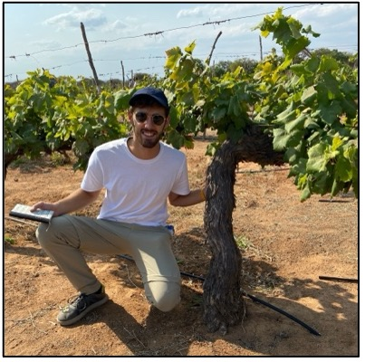
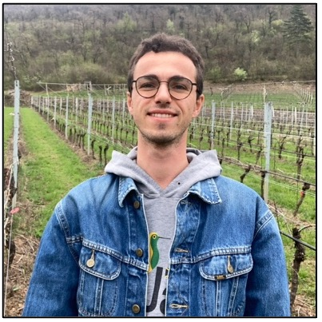

# The team

We are a team of young and experienced enological and viticultural consultants with a unique multidisciplinary approach. Our diverse expertise allows us to tackle challenges from multiple perspectives, ensuring tailored solutions. Our journey began in 2017 at the prestigious Edmund Mach Foundation in Italy, where we pursued together our studies in Viticulture and Enology, and we worked together on our shared thesis: the renovation of an abandoned vineyard estate. Since then, our paths diverged, but our commitment to exchanging ideas and refining our craft has kept us united.

## Luca Girardi

Luca is a vineyard professional. He started from the basics, with hands-on experience as a grape harvester and evolved into mastering vineyard management. Today, he excels in cultivars knowledge, sustainable treatments, and eventually ensuring optimal grape quality—the cornerstone of exceptional wines. With international experience in Italian, France and Swiss wineries, Luca has also honed his skills in producing wine in various styles. Moreover, he values finding time for continuously updating his expertise through a Master of Science in Sustainable Viticulture and Enology. His dedication ensures that every grape’s potential is fully realized.

[Most relevant experiences]{.underline}

-   Vineyard operator and Cellar hand

    -   Piollot - Champagne (Côte des Bar, France)
    -   Domaine Rostaing (Côte Rôtie, France)

-   Vineyard tractor driver

    -   Tenute Lunelli (Trento, taly)
    -   Baldo Emanuele (Trento, Italy)

-   Vine nursery (management) worker

    -   Vivai Viticoli Trentini (Trento, Italy)

[Main skills]{.underline}

-   Vineyard management
-   Business cases
-   Customer relations
-   Field staff training

## Filippo Rigotti

Filippo is undeniably one of the most skilled winemakers we ever worked with. With an intuitive ability to tailor the winemaking process by nose, Filippo also possesses a deep understanding of the chemical reactions at play, enabling him to steer them with precision. This allows him to create excellent winemaking protocols. Having worked as an enologist in top wineries across Italy and France, he has perfected his style and taste across all wine types. Filippo’s versatility extends to handling both small-scale operations, as demonstrated in his own experimental cellar, and managing very large volumes of musts and wines. Provide him with the essential analyses, and he will craft exceptional results with unmatched expertise.

[Most relevant experiences]{.underline}

-   Winery manager

    -   Azienda agricola Pravis (Trentino, Italy)

-   Cellar hand

    -   Domaine Rostaing (Côte Rôtie, France)

[Main skills]{.underline}

-   Winemaking management and winemaking protocols
-   Musts and wine analyses
-   Winery management

## Davide Saccardo

Davide is our international specialist. Since graduating, his adventurous spirit has taken him to emerging wine regions around the globe. Notably, he contributed to the construction and initial development of a winery in Azerbaijan. His meticulous nature and sharp memory make him an indispensable manager with a strategic mindset. Davide’s extensive knowledge of winemaking techniques ensures he can adapt to any condition, delivering excellence every time. Currently, he is heading to New Zealand to further refine his craft in one of the world’s premier winemaking regions.

[Most relevant experiences]{.underline}

-   Enologist and Operation Director

    -   Savalan Aspi Winery (Qabala, Azerbaijan)

-   Enologist and Winemaker

    -   Winery K. Martini und Sohn (South Tyrol, Italy)

[Main skills]{.underline}

-   Winemaking management
-   Winery planning
-   Winery staff training

## Alessandro Bignardi

Alessandro’s expertise bridges science and innovation. After stepping away from vineyards to explore rice biotechnology and indoor farming in Denmark, he earned a Master of Science in Crops and Plant Sciences. Now pursuing a PhD in grapevine physiology, Alessandro is uncovering the intricacies of bud regulation. Known for his analytical mindset and creativity, he challenges traditional practices to develop smarter, more efficient solutions. His forward-thinking approach drives research and practical advancements in our wine projects.

[Most relevant experiences]{.underline}

-   Grapevine Physiology PhD Fellow

    -   Edmund Mach Foundation (Trentino, Italy)

-   Visiting scholar affiliate

    -   Irrigated Agriculture Research and Extension Center at Prosser, WA (USA)

-   Cellar hand and Lab technician

    -   Bellavista (Lombardy, Italy)

[Main skills]{.underline}

-   Project management
-   Research and Development
